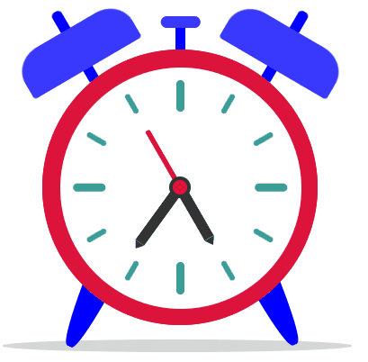

<!-- Actualice el valor en {}  -->

<!-- <h1 align="center">{Your project name}</h1> -->

<h1 align="center">Alarm Clock ⏰</h1>

<!-- 

   Solution for a challenge from  <a href="http://devchallenges.io" target="_blank">Devchallenges.io</a>.

 -->

<!-- 

  <h3>
    <a href="https://{your-demo-link.your-domain}">
      Demo
    </a>
     | 
    <a href="https://{your-url-to-the-solution}">
      Solution
    </a>
     | 
    <a href="https://devchallenges.io/challenges/wBunSb7FPrIepJZAg0sY">
      Challenge
    </a>
  </h3>

 -->

<!-- TABLA DE CONTENIDO -->

## Table of Contents

- [Overview](#overview)
  - [Built With](#built-with)
  <!-- - [Features](#features) -->
- [Contact](#contact)

<!-- VISIÓN GENERAL -->

## Overview

  

<!-- Presente sus proyectos tomando una captura de pantalla o un gif. Intente contarles a los visitantes una historia sobre su proyecto respondiendo:

- ¿Dónde puedo ver tu demo?
- ¿Cuál fue tu experiencia?
- ¿Qué has aprendido/mejorado?
- ¿Tu sabiduría? :) -->

<!-- - Where can I see your demo?
- What was your experience?
- What have you learned/improved?
- Your wisdom? :) -->

<!-- OVERVIEW -->

<!-- ## Vista General -->

<!-- ### Vista previa en Mobile

  

 -->

<!-- ### Vista previa en Tablet

  

### Vista previa en Desktop

  

 -->

<!-- CONSTRUIDO CON -->

### Built With

<!-- Esta sección debe enumerar los principales lenguajes que utilizó para construir su proyecto -->

<!-- - [React.js](https://reactjs.org/)
- [Vue.js](https://vuejs.org/)
- [Tailwind](https://tailwindcss.com/) -->

- [Html](https://developer.mozilla.org/es/docs/Web/HTML)
- [Css](https://developer.mozilla.org/es/docs/Web/CSS)
- [JavaScript](https://developer.mozilla.org/es/docs/Web/JavaScript)

<!-- CARACTERISTICAS -->

<!-- ## Features -->

<!-- Enumere las características de su aplicación o siga la plantilla. No compartas el archivo figma aquí :) -->

<!-- This application/site was created as a submission to a [DevChallenges](https://devchallenges.io/challenges) challenge. The [challenge](https://devchallenges.io/challenges/wBunSb7FPrIepJZAg0sY) was to build an application to complete the given user stories. -->

<!-- Esta aplicación/sitio se creó como envío a un desafío [DevChallenges](https://devchallenges.io/challenges). El [desafío](https://devchallenges.io/challenges/wBunSb7FPrIepJZAg0sY) fue crear una aplicación para completar las historias de usuario dadas. -->

<!-- CONTACTO -->

### Demo

- Website [https://jaenfigueroa.github.io/Alarm-Clock/](https://jaenfigueroa.github.io/Alarm-Clock/)

## Contact

<!-- - Website [tu-sitio-web.com](https://{your-web-site-link}) -->

- GitHub [@jaenfigueroa](https://github.com/jaenfigueroa})
- Twitter [@jaenfigueroa1](https://twitter.com/jaenfigueroa1)
- Facebook [@jaenfigueroa](https://facebook.com/jaenfigueroa)
